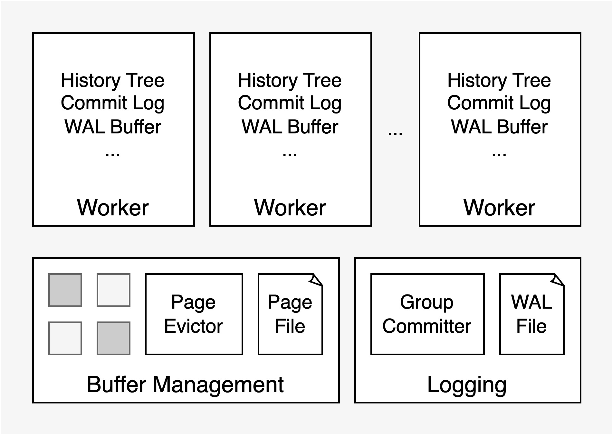

<!--
[](https://github.com/zz-jason/leanstore/actions/workflows/c-cpp.yml)
-->
[](https://dl.circleci.com/status-badge/redirect/circleci/MkFUq3aTNH5S7gLVEtwrGF/XCiiFNumkGdcD65tKp4EEy/tree/master)
[](https://codecov.io/github/zz-jason/leanstore)

# LeanStore

[LeanStore](https://db.in.tum.de/~leis/papers/leanstore.pdf) is a
high-performance OLTP storage engine optimized for many-core CPUs and NVMe SSDs.
Our goal is to achieve performance comparable to in-memory systems when the data
set fits into RAM, while being able to fully exploit the bandwidth of fast NVMe
SSDs for large data sets. While LeanStore is currently a research prototype, we
hope to make it usable in production in the future.

<div align='center'>

</div>

## Getting started

It's recommanded to develop the project inside the docker container, which can
be built from the Dockerfile defined in
[docker/Dockerfile](./docker/Dockerfile).

```sh
# build and test
cmake --preset debug
cmake --build build/debug -j `nproc`
ctest --test-dir build/debug -j `nproc`
```

## Contributing

Contributions are welcomed and greatly appreciated! "good-first-issue" is a good
start point, see the [Contributing](./Contributing.md) file for details about
the contributing workflow, develop guide, and contributor communication etc.

## License

LeanStore is under the MIT License. See the [LICENSE](./LICENSE) file for
details.

## Acknowledgments

Thanks the LeanStore authors for the great
[leanstore](http://github.com/leanstore/leanstore) project and the idea behind
it.
